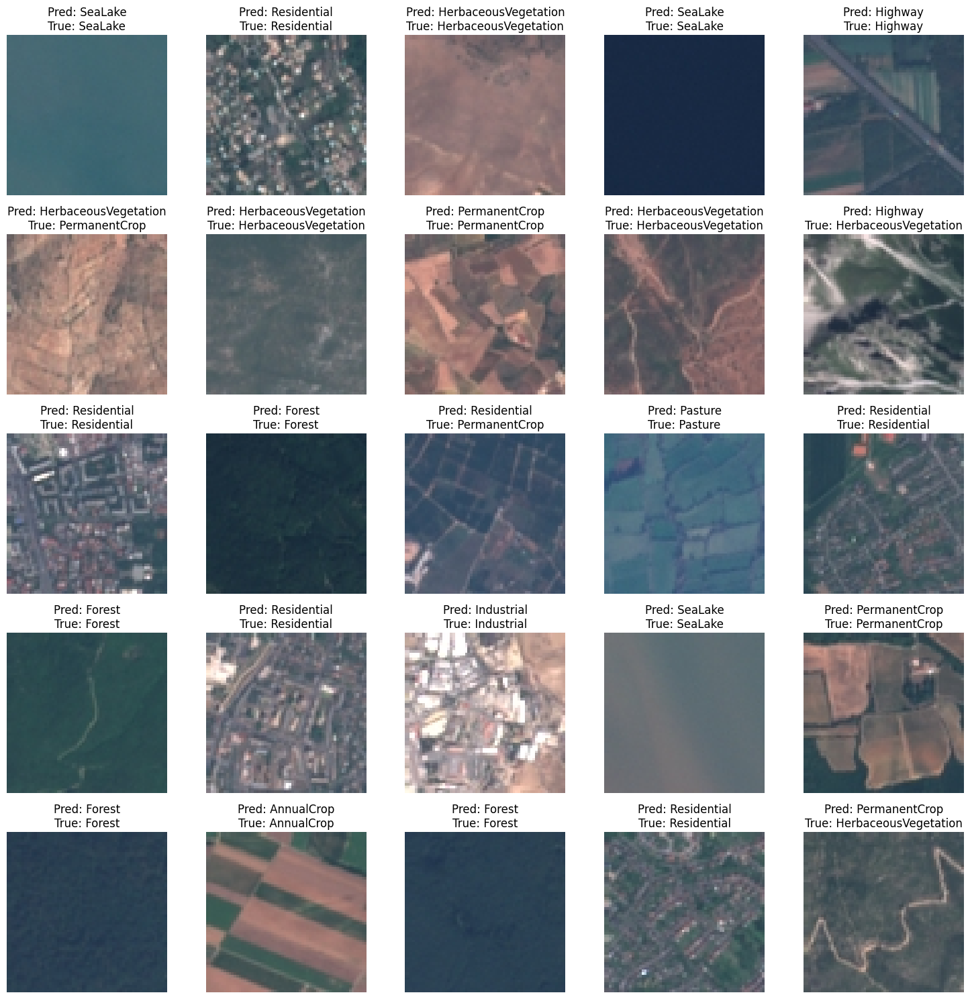
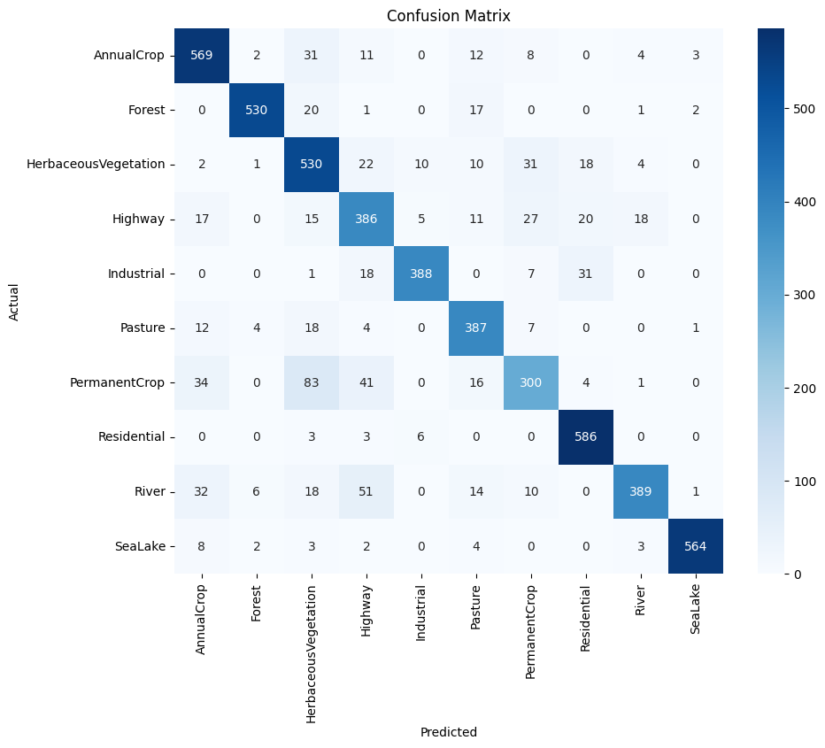

# Image Classification with Neural Network

This project demonstrates an image classification pipeline using a Convolutional Neural Network (CNN) built with PyTorch. The goal is to classify images into 11 distinct categories based on visual patterns.

---

## Dataset

- **Total Images**: 27,000
- **Training Set**: 21,600 images (80%)
- **Test Set**: 5,400 images (20%)

---

## Model Architecture

The model is a CNN designed for optimal performance and reasonable training time, with the following components:

1. **Convolutional Layers**:
   - **Layer 1**: 3 input channels (RGB) -> 16 filters.
   - **Layer 2**: 16 input channels -> 32 filters.
   - **Layer 3**: 32 input channels -> 64 filters.
   - Each convolutional layer uses a kernel size of 3x3 with ReLU activation.

2. **Pooling**:
   - Max Pooling with kernel size 2x2 applied after each convolutional layer to reduce dimensions.

3. **Fully Connected Layers**:
   - **Layer 1**: Input size = 4096 (64 channels × 8x8 spatial dimensions) -> 512 neurons.
   - **Layer 2**: Input size = 512 neurons -> 11 output classes.

4. **Activation**: ReLU is used for activation in all layers.
5. **Forward Pass**: The model applies convolution, pooling, and flattens the output before feeding it to the fully connected layers.

---

## Training and Validation

- **Epochs**: 10
- **Batch Size**: Optimized for training time and memory efficiency.
- **Optimizer**: Adam optimizer with a learning rate tuned for convergence.
- **Loss Function**: CrossEntropyLoss for multi-class classification.

### Training Results:
- **Accuracy Progression**:
  - Epoch 1: 55.51%
  - Epoch 5: 84.05%
  - Epoch 10: 93.57%
- **Validation Accuracy**: Stabilized at ~85.72% by the 10th epoch.

---

## Evaluation

### Key Metrics:
- **Confusion Matrix**: Highlights classification performance across all 11 categories.
- **Misclassifications**:
  - **Highway vs River**: Visual similarity in curved patterns.
  - **PermanentCrop vs HerbaceousVegetation**: Misclassified when lines in fields are unclear.
  - **Highway vs PermanentCrop**: Distinct lines resembling highways.

### Insights:
- The model performs well in distinguishing visually distinct classes.
- Struggles with visually similar categories, which may benefit from separate training or a more complex model.

### Visualization:
- Predicted vs Actual images are shown to evaluate model performance qualitatively.
- Below are the few outputs.

---

## Results and Future Work

- The model achieves **93.57% training accuracy** and **85.72% validation accuracy**.
- Potential Improvements:
  - Train visually similar classes separately.
  - Increase model complexity cautiously to avoid overfitting.

---

## License

This project is licensed under the [MIT License](LICENSE).
